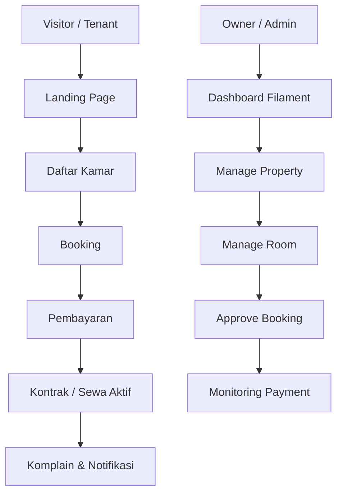

<div align="center">

# <strong>Kostify</strong>

<strong>Pengelolaan dan Pemesanan Kos & Kontrakan Berbasis Web</strong>

[🌐 Lihat Website](https://kostify.my.id/)

</div>

## Informasi Proyek UAS

- Proyek UAS: Pengelolaan dan Pemesanan Kos & Kontrakan Berbasis Web
- Nama: [Angga Aditya]
- NIM: [20240801165]
- Mata Kuliah: Pemrograman Web
- Dosen Pengampu: [EFRY SUNUPURWA ASRI , S.Kom., M.Kom.]
- Program Studi: [Teknik Informatika]

[](https://laravel.com)
[](https://www.php.net)
[](https://www.docker.com)
[](LICENSE)
[](https://github.com)

Kostify adalah aplikasi web manajemen kos modern yang membantu pemilik properti dan penyewa dalam mengelola proses sewa secara lebih terorganisir. Aplikasi ini menggabungkan sisi publik untuk pencarian kamar, sisi tenant untuk proses booking dan pembayaran, serta sisi admin/owner untuk pengelolaan operasional kos.

Project ini dibangun dengan Laravel, Livewire, Filament, Tailwind CSS, MariaDB, dan Docker, sehingga cocok untuk kebutuhan sistem kos yang scalable dan siap dikembangkan lebih lanjut.

## Fitur Utama

- Manajemen properti dan kamar kos
- Pencarian dan daftar kamar untuk penyewa
- Proses booking kamar secara online
- Pengelolaan tagihan, invoice, dan pembayaran
- Integrasi pembayaran dengan Midtrans
- Fitur perpanjangan sewa
- Komplain dan komunikasi penyewa dengan pengelola
- Dashboard admin/owner berbasis Filament
- Notifikasi otomatis terkait booking dan pembayaran
- Sistem role dan akses berbasis peran pengguna

## Role Pengguna

- Super Admin: mengelola seluruh sistem, data pengguna, properti, dan transaksi
- Owner: mengelola properti, kamar, booking, dan pembayaran miliknya
- Tenant / Customer: melihat daftar kamar, melakukan booking, membayar tagihan, dan mengajukan komplain

## Tech Stack

- Backend: Laravel 12, PHP 8.2
- Frontend: Livewire, Blade, Tailwind CSS, Vite
- Admin Panel: Filament
- Database: MariaDB
- Container: Docker + Nginx
- Payment Gateway: Midtrans
- Testing: Pest

## Requirements

Pastikan perangkat Anda sudah memiliki:

- Docker Desktop / Docker Engine
- Docker Compose
- Git
- Node.js (opsional untuk development frontend)
- Composer (opsional jika dijalankan tanpa Docker)

## Instalasi

### 1. Clone repository

```bash
git clone <repo-url>
cd kostify
```

### 2. Salin file environment

```bash
cp src/.env.example src/.env
```

### 3. Jalankan container Docker

```bash
docker compose up -d --build
```

### 4. Install dependency aplikasi

```bash
docker compose exec php composer install
docker compose exec php php artisan key:generate
docker compose exec php php artisan migrate --seed
```

### 5. Jalankan asset frontend

```bash
docker compose exec php npm install
docker compose exec php npm run build
```

### 6. Akses aplikasi

- Frontend: http://localhost
- Admin panel: http://localhost/admin

## Cara Menjalankan Project

### Menggunakan Docker

```bash
docker compose up -d
```

### Menjalankan secara lokal

```bash
cd src
composer install
npm install
cp .env.example .env
php artisan migrate --seed
php artisan serve
npm run dev
```

## Konfigurasi .env

Beberapa variabel penting yang perlu disesuaikan:

```env
APP_NAME="Kostify"
APP_ENV=local
APP_URL=http://localhost

DB_CONNECTION=mariadb
DB_HOST=db
DB_PORT=3306
DB_DATABASE=kostify
DB_USERNAME=root
DB_PASSWORD=p455w0rd

MIDTRANS_SERVER_KEY=your_server_key
MIDTRANS_CLIENT_KEY=your_client_key
MIDTRANS_IS_PRODUCTION=false
```

## Arsitektur Sistem



## Struktur Folder Utama

```text
src/
  app/
  config/
  database/
  public/
  resources/
  routes/
  tests/
```

## Kontributor

Kontribusi sangat terbuka untuk pengembangan lebih lanjut. Silakan fork repository ini, buat branch fitur, lalu kirim pull request.

## License

Proyek ini menggunakan lisensi MIT.
